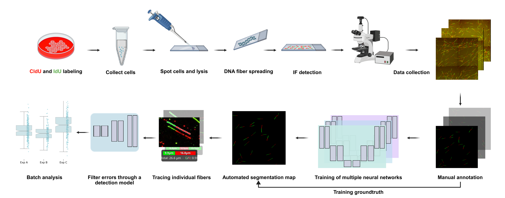
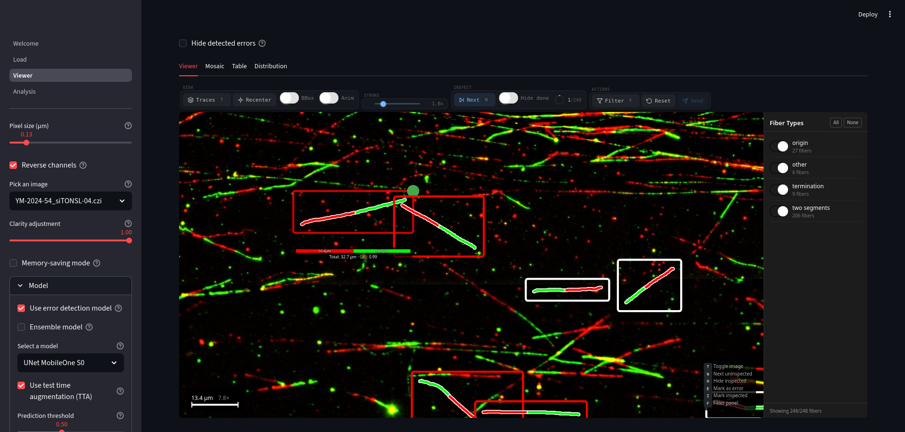

<p align="center">
  <h1 align="center">DNAi</h1>
  <p align="center">
    Automated segmentation, enumeration, and measurement of DNA replication fibers in fluorescence microscopy images.
  </p>
  <p align="center">
    <a href="https://colab.research.google.com/github/ClementPla/DNAi/blob/main/Colab/DNAi.ipynb">
      
    </a>
    <a href="https://hub.docker.com/r/clementpla/dnafiber">
      
    </a>
    <a href="#">
      
    </a>
    <a href="https://doi.org/10.5281/zenodo.19237853"></a>
  </p>
</p>

---

DNAi is a free, open-source tool for the automated analysis of DNA fiber spreading assays. It segments individual fibers from fluorescence microscopy images, classifies them by replication structure (ongoing forks, bidirectional origins, terminations, etc.), and computes tract length ratios — all without requiring any programming skills. DNAi is designed to be approximately **30× faster** than manual annotation while maintaining strong agreement with trained human graders.




## Features

- **Deep learning segmentation** — Semantic segmentation of first and second analog labels, with optional ensemble inference and test-time augmentation (TTA) for improved robustness.
- **Error detection** — A secondary classifier filters out false positives, boosting precision without sacrificing measurement accuracy.
- **Junction disentanglement** — Automatic resolution of crossing and branching fibers at junction points.
- **Batch processing** — Queue multiple whole-slide images and receive automatically produced measurements and charts.
- **Cross-platform support** — Validated on images from Zeiss, Leica, and DeltaVision microscopes, including S1 nuclease assays.
- **Multiple interfaces** — Web-based GUI (Streamlit), Python API, Docker, and Google Colab.




## Installation

DNAi requires **Python 3.10+**. We recommend using a virtual environment.

### Python package

```bash
pip install git+https://github.com/ClementPla/DNAi.git
```
Or, if you have a cuda-compatiable GPU:

```bash
pip install git+https://github.com/ClementPla/DNAi.git[gpu]
```
However, you may prefer install torch yourself in the case, depending on the cuda drivers at your disposal.

### Graphical User Interface

After installation, launch the GUI from your terminal:

```bash
DNAI
```

Then open your browser at `http://localhost:8501`.

### Docker

```bash
docker pull clementpla/dnafiber
docker run -p 8501:8501 clementpla/dnafiber
```

### Google Colab

No local installation required — run DNAi directly in the browser:

[](https://colab.research.google.com/github/ClementPla/DNAi/blob/main/Colab/DNAi.ipynb)

## Quick Start (Python API)

```python
from pathlib import Path
from dnafiber.deployment import run_one_file
from dnafiber.model.utils import get_ensemble_models, get_error_detection_model

# Load models
model = get_ensemble_models()
error_model = get_error_detection_model()

# Run inference on a single image
fibers = run_one_file(
    Path("image.czi"),            # Supports .czi, .tiff, .dv, .png, .jpeg
    model=model,
    pixel_size=0.13,              # µm/pixel
    use_tta=False,
    error_detection_model=error_model,
    device="cuda",
)

# Filter and export
fibers = fibers.valid_copy()                # Keep only classifiable fibers
fibers = fibers.filter_errors(threshold=0.5) # Remove likely false positives

df = fibers.to_df(pixel_size=0.13, img_name="image.czi")
df.to_csv("results.csv", index=False)
```

### What you get

| Property | Description |
|---|---|
| `fibers.ratios` | Second analog / first analog tract length ratios |
| `fibers.lengths` | Total fiber lengths (in pixels) |
| `fibers.to_df()` | Export to a pandas DataFrame with per-fiber metrics |
| `fibers.to_pickle()` | Serialize the full `Fibers` object for later use |
| `fibers.get_labelmap(h, w)` | Reconstruct a 2D label map from the fiber set |

### Filtering by fiber type

```python
# Keep only ongoing forks (two-segment fibers)
double = fibers.only_double_copy()

# Keep only bidirectional origins (three-segment fibers)
triple = fibers.only_triple_copy()
```

## Supported File Formats

| Format | Notes |
|---|---|
| `.czi` (Zeiss) | Preprocessing (normalization, channel extraction) applied automatically |
| `.tiff` / `.tif` | Multi-channel or RGB |
| `.dv` (DeltaVision) | Preprocessing applied automatically |
| `.png` / `.jpeg` | Expected to be already preprocessed |

## Model Configurations

DNAi supports several inference configurations, trading off speed and accuracy:

| Configuration | Speed | Precision | Recall |
|---|---|---|---|
| Single model | Fastest | Baseline | Baseline |
| Ensemble | ~3× slower | Improved | Improved |
| + TTA | ~8× slower | Further improved | Slightly reduced |
| + Error detection | Minimal overhead | Substantially improved | Reduced |

All configurations remain at least **29× faster per fiber** than manual annotation.

## Citation

If you use DNAi in your research, please cite:
Clément Playout, Yosra Mehrjoo, Renaud Duval, Marie Carole Boucher, Santiago Costantino, Hugo Wurtele, DNAi: an open-source AI tool for unbiased DNA fiber analysis, Nucleic Acids Research, Volume 54, Issue 7, 24 April 2026, gkag335, https://doi.org/10.1093/nar/gkag335

```bibtex
@article{10.1093/nar/gkag335,
    author = {Playout, Clément and Mehrjoo, Yosra and Duval, Renaud and Boucher, Marie Carole and Costantino, Santiago and Wurtele, Hugo},
    title = {DNAi: an open-source AI tool for unbiased DNA fiber analysis},
    journal = {Nucleic Acids Research},
    volume = {54},
    number = {7},
    pages = {gkag335},
    year = {2026},
    month = {04},
    abstract = {DNA fiber assays are powerful tools for investigating replication dynamics at the single-molecule level. However, their application and widespread adoption has been hampered by the labor-intensive and tedious nature of manual analysis of large numbers of images. Quantification of labeled DNA fibers typically depends on subjective examination, selection, and annotation of individual fibers from fluorescence microscopy images reducing inter-user consistency, reproducibility, and experimental throughput. To address these issues, we developed DNAi, a computer vision tool based on deep learning allowing automated detection and quantification of labeled DNA fiber length. DNAi was trained on a large and diverse dataset of manually annotated images of DNA fibers and matches human performance and accuracy in segmentation and length measurement across a wide range of experimental conditions. The open-source tool includes a user-friendly interface, which permits visual validation and manual selection of segmented fibers. Overall, DNAi enables robust, rapid, and reproducible DNA fiber analysis, and is freely available.},
    issn = {1362-4962},
    doi = {10.1093/nar/gkag335},
    url = {https://doi.org/10.1093/nar/gkag335},
    eprint = {https://academic.oup.com/nar/article-pdf/54/7/gkag335/68117773/gkag335.pdf},
}


```

## License

This project is licensed under the MIT License — see the [LICENSE](LICENSE) file for details.
